<!-- Text can be **bold**, _italic_, or ~~strikethrough~~. -->

<!-- [Link to another page](./another-page.html). -->

<!-- There should be whitespace between paragraphs. -->

This website has been developed as part of the final project for CS 7641: Machine Learning (Spring 2024) at Georgia Tech. Our team consists of:
1. Divij Mishra
2. Karan Nahar
3. Parth Athale
4. Priyanka Singh
5. Vamsi Kalidindi

## Table of Contents

1. [Introduction/Background](#introduction/background)
2. [Problem Definition](#problem-definition)
3. [Methods](#methods)
4. [Results and Discussion](#results-and-discussion)
5. [References](#references)
6. [Gantt Chart](#gantt-chart)
7. [Contribution Table](#contribution-table)

## Introduction/Background
Our project aims to tackle the issue of AI-based fake news generation by training models to classify a given article as human-written or machine-generated. 

Previous work indicates that it is difficult for humans to distinguish between human-written news and GPT-3 news, highlighting the importance of fake news detection systems [3]. However, it is not clear whether larger models will necessarily be better at discriminating between the two types of news. [1] indicates that language models which are good at generating fake news are the best at detecting fake news, which leads us to believe LLMs would perform well at this task. Surprisingly, [2] observed that Transformer-based models may not generalize well, while traditional models may generalize better and provide an understanding of which features are important. 

### Dataset

The dataset we plan to use was used to develop the GROVER model [1], which can generate fake news as well as detect fake news generated by AI. The dataset comprises headlines and article texts with a label indicating whether they are real or fake.

GROVER AI detection tool was designed to identify and prevent the spread of fake news. Grover is pre-trained on a large corpus of text data. During pre-training, the model learns to predict the next word in a sequence given the context of the previous words. Grover utilizes a bidirectional attention mechanism for generating text. 

The GROVER dataset consists of multiple samples based on the generation process. We used the sample generated by the smallest GROVER variant, Grover-Base, with nucleus sampling probability = 1.00 (i.e. no nucleus sampling). We used this for our proof-of-concept model, expecting it to be the easiest sample to train on. We expect our methods to extend easily to more difficult samples, generated with bigger GROVER variants and better nucleus sampling probabilities. 

## Problem Definition
Using the GROVER dataset, we plan to fine-tune a Large Language Model (LLM) to classify news articles into machine-generated and human-written. In addition, we aim to classify news articles into different topics using clustering approaches. Combining the above, we plan to conduct a topic-wise analysis of our LLM-based machine-generated news detection method.

<!-- ## Methods
1. We wish to fine-tune an LLM for classification on the GROVER dataset. We have tentatively chosen OpenLLaMA – 7B as our model. We have access to the 16GB Nvidia Tesla T4 GPU via Google Colab Pro. It is feasible to fine-tune a 7B LLM on such hardware using QLoRA for compression and approximate fine-tuning. 
2. We aim to train a smaller classification model on the same dataset. We plan to use TF-IDF for feature generation, PCA for dimensionality reduction, and XGBoost for classification. 
3. If we have sufficient time, we plan to use topic modeling and clustering techniques, based on the BERTopic pipeline, to cluster articles in the GROVER dataset based on news topics. Based on this, we aim to analyze whether machine-generated news might be easier to detect in certain domains over others. 
4. Since the GROVER dataset consists of mostly text data, we would likely need multiple preprocessing techniques to perform TF-IDF. We plan to use spaCy for tokenization, stop-word removal, and lemmatization.  -->

<!-- ## Potential Results
Our project goals are to train reliable discriminative classifiers to identify machine-generated news articles. As our problem is a classification problem, we would like to compare our classifiers on the following metrics: accuracy, precision, recall, F1-score. After topic modeling and clustering, we will have a topic-label associated with each article. As such, we will also compare category-wise precision, recall, and macro-averaged F1-score. 

We expect to be able to quantify the improvement in fake news classification using an LLM and provide a low-resource technique for fake news detection.  -->

## Methods

For the midterm checkpoint, we primarily focused on topic clustering our news articles based on the headline text, as described below. Additionally, we took our first steps towards fine-tuning LLaMA-7B by setting up appropriate environments on the PACE cluster and studying LLM fine-tuning techniques in more detail.

#### Data Preprocessing

##### Topic Clustering

1. **Tokenization:** 
   - The titles are tokenized into individual words using NLTK's word tokenize function.
2. **Lowercasing:** 
   - All words are converted to lowercase to ensure uniformity.
3. **Removing non-alphabetic tokens:** 
   - Punctuation and other non-alphabetic tokens are filtered out.
4. **Stopword removal:** 
   - Stopwords, which are common words that do not carry significant meaning (e.g., 'the', 'is', 'and'), are removed from the tokenized words using NLTK's English stopwords list.
5. **Word not in Pretrained Embeddings:** 
   - Further, the words which are not there in Word2vec/GloVe embeddings are removed from the headings.

##### LLM Fine-Tuning

1. **Article Truncation** 
	- The news articles in the dataset typically consist of over 1000 words, with the maximum being 13000 words. Since LLaMa-2 7B has a token limit of 4096 (roughly 0.75 tokens per word), we needed to truncate the article size. To be very conservative, we truncated every article to <= 800 words. We made sure to keep the maximum number of sentences while ensuring the word count was under 800. 
2. **Prompt Engineering**
	- As we’re doing instructional fine-tuning, we need to set up training prompts for the model. The prompt we used was 
3. **Tokenization**
	- Used LLaMA-2 7B’s default tokenizer from HuggingFace.

#### Models Implemented 

##### LLM Fine-Tuning

We have fine-tuned LLaMA-2 7B on the GROVER dataset. LLaMA-2 is an LLM developed by Meta AI – we used the open source 7B parameter version available from HuggingFace. To fine-tune the model, we used instruction fine-tuning.  
 
Fine tuning is a process where pre-trained model is further trained on a custom dataset inorder to adapt it to custom tasks.  
 
Since LLMs have so many parameters, fine-tuning takes a lot of time and memory. Naively training a 7B parameter model in float32 would take 112GB memory (to store parameters, gradients, and possibly optimizer states). To solve this problem, researchers have developed various parameter efficient fine-tuning techniques (PEFT). A popular one is QLoRA  (https://proceedings.neurips.cc/paper_files/paper/2023/file/1feb87871436031bdc0f2beaa62a049b-Paper-Conference.pdf). 

QLoRA combines two techniques: 
1. Quantization – this involves using lower precision data types for model weight storage and computation, such that overall model accuracy does not suffer too much. 
2. LoRA (Low-Rank Adaptation of Large Language Models) - This technique introduces trainable rank decomposition matrices into a layer of transformer architecture and also reduces trainable parameters for the downstream task while keeping the pretrained weights frozen. 

##### Topic Clustering
 
We wanted to use clustering on the news headlines from our dataset to divide them into topics. Initially we used Word2vec for word embeddings, specifically word2vec-google-news-300. The model gave a word vector of 300 elements for each word. The data went through some further preprocessing to remove words which were not in the Word2vec vocabulary and taking the average of all words in a headline to have a vector for each headline. Along with it, we tried embeddings through the GloVe model and then took the average. For topic clustering, we adopted two approaches. The first one was k-means clustering with 10 clusters on the entire headline dataset. The second approach was a semi-supervised one. We decided the news topics beforehand and calculated the word vectors for each. We took the cosine similarity of each headline with each topic and picked the best match in each case. This enabled us to fit the headlines to an existing set of topics.   

##### BERTopic

1. **Preprocessing and Default Embedding**
	- Preprocessing plays a crucial role in preparing the textual data for analysis. In this step, we focused on removing stopwords, which are common words that often do not carry significant meaning in the context of the text. By eliminating stopwords, we aim to reduce noise and improve the quality of the data fed into the subsequent stages of analysis. 
	- For default embedding, we employed BERTopic, a powerful tool that leverages state-of-the-art language representation models like BERT. BERTopic offers a sophisticated approach to topic modeling by integrating BERT-based embeddings, which capture rich semantic information from the input text. 

2. **Model Loading**
	- In this phase, we utilized a specific variant of BERTopic known as Sentence Transformer model. This model extends the capabilities of BERT by fine-tuning it for sentence-level tasks, enabling it to generate contextualized embeddings tailored for capturing the semantics of entire sentences. 
	- Additionally, we incorporated dimensionality reduction techniques such as UMAP (Uniform Manifold Approximation and Projection) to reduce the high-dimensional embeddings generated by the Sentence Transformer model into a lower-dimensional space. This reduction in dimensionality helps in visualizing and interpreting the data more effectively. 

3. **Clustering**
	- Clustering is a fundamental unsupervised learning technique used to group similar data points together. In our analysis, we employed clustering algorithms to partition the reduced-dimensional embeddings into distinct clusters, each representing a coherent topic or theme present in the text data. 
	- We experimented with three different clustering methods: 
	1. **DBSCAN with Default Parameters**: We initially applied DBSCAN (Density-Based Spatial Clustering of Applications with Noise) with default parameters. This method identifies clusters based on the density of data points in the feature space. However, we observed a high number of clusters (defaulting to 180), which prompted further exploration. 
	2. **K-Means with 16 Clusters**: Drawing from methodologies used in previous analyses, we applied the K-Means clustering algorithm with a predefined number of clusters (16). This approach aims to partition the data into a predetermined number of clusters, facilitating a more structured and interpretable representation of the topics. It also helps in comparing the Topic modelling results with our initial existing results for Word2Vec and GloVe. 
	3. **DBSCAN with Parameter Tuning and Hard Clustering**: Recognizing the limitations of the default DBSCAN parameters, we experimented with adjusting the parameters to reduce the number of clusters. Additionally, we introduced a novel technique of hard clustering on outlier clusters. This involved identifying outlier clusters and reassigning them to the nearest cluster based on cosine similarity of top N words. This adaptive clustering strategy aims to enhance the coherence and granularity of the topic clusters. 
	
4. **Vectorization and Topic Assignment**
	- Following clustering, we proceeded to vectorize the clustered data using TF-IDF to get the most important words in each topic. 
	- Finally, we assigned topics to the vectorized data based on the clusters identified through the clustering algorithms. This step involved associating each data point with the most representative topic or theme inferred from the clustering results. 

#### Results and discussion

##### LLM Fine-Tuning

###### Quantitative Metrics

To evaluate the results of our LLM fine-tuning, we used typical binary classification metrics – accuracy and F1-score. We additionally provide classification reports and confusion matrices as well. The GROVER sample we used had 12000 train samples (balanced), 3000 val samples (unbalanced – 2:1 human:machine), and 12000 test samples (unbalanced – 2:1 human:machine). Expecting that fine-tuning an LLM would take a lot of time, we used only 1000 train samples (a later experiment showed no improvement with more training data and epochs). Also, owing to a Hugging Face bug, evaluation (model text generation) was very slow, so we only used 100 test samples for model evaluation.  
 
Additionally, if the model fails to respond with either “human” or “machine” (e.g. responding with both “human” and “machine” or giving an empty response), we set the default answer to “human”, mimicking the dangerous human tendency to assume that a news article is human-generated by default. 
 
In the results below, 0 represents “human” and 1 represents “machine”. 
 
When we evaluate the pretrained model without any finetuning, we get the following results. Note that the model is unable to respond “machine” to any input article. The accuracy of 0.7 comes from the test set class imbalance – the poor performance is exhibited by the 41% F1-score. 

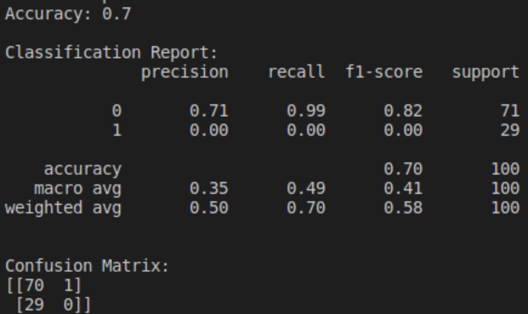

After fine-tuning for just 1 epoch on 400 data, we see the following. We see here that the model is not really learning much apart from the relative proportions of the training labels – these results can be explained by random guessing according to the training data proportions. 

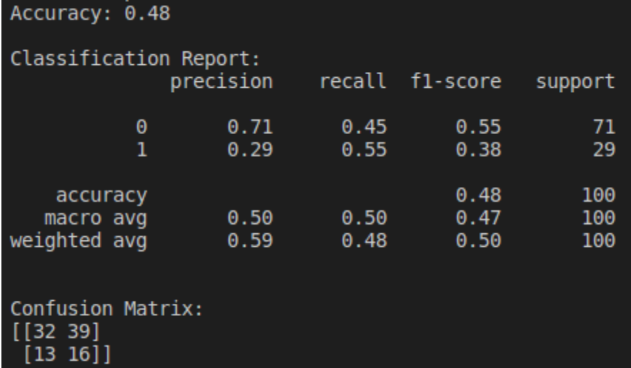

After fine-tuning for 2 epochs on 1000 data, we see significant improvement! We get 81% accuracy and 72% F1-score.  

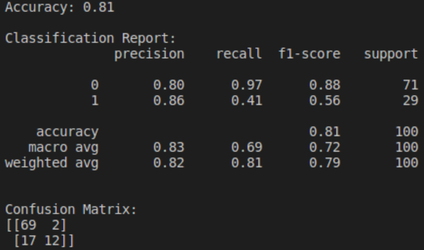

In an attempt to scale our performance up, we fine-tuned on 2500 data for 4 epochs as well. However, we found no significant improvement. 

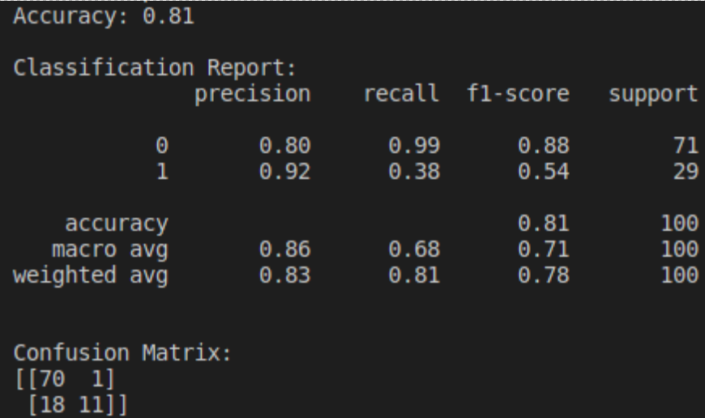

###### Analysis and Comparison

The other hyperparameters we used for fine-tuning are available in our code. Further experimentation with the hyperparameters might allow us to use more data and achieve better metrics. 
 
The GROVER paper trains BERT-based and GROVER-based models as discriminators. <do we want to include this?> Note that they train on a different task – their discriminators also use other parts of the article metadata, e.g. author, date, etc for classification, which might explain their higher accuracies.

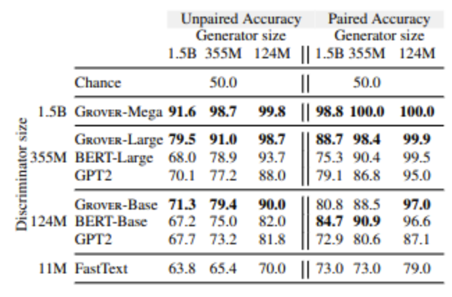

To fine-tune our models, we used Georgia Tech’s PACE-ICE cluster, where we used an A100-40GB for training. Fine-tuning with 1000 samples for 2 epochs took approximately 15 min, with a batch size of 4. As pointed out earlier, a bug in the Hugging Face text generation code slowed down evaluation by a lot – evaluating 100 samples with a batch size of 1 took approximately 20 min. As such, we limited the evaluation dataset to 100 samples, which is not ideal. 

##### Topic Clustering

###### Visualizations

For the midterm report, we performed K means clustering for different cluster values and observed the sum of squared distances. 

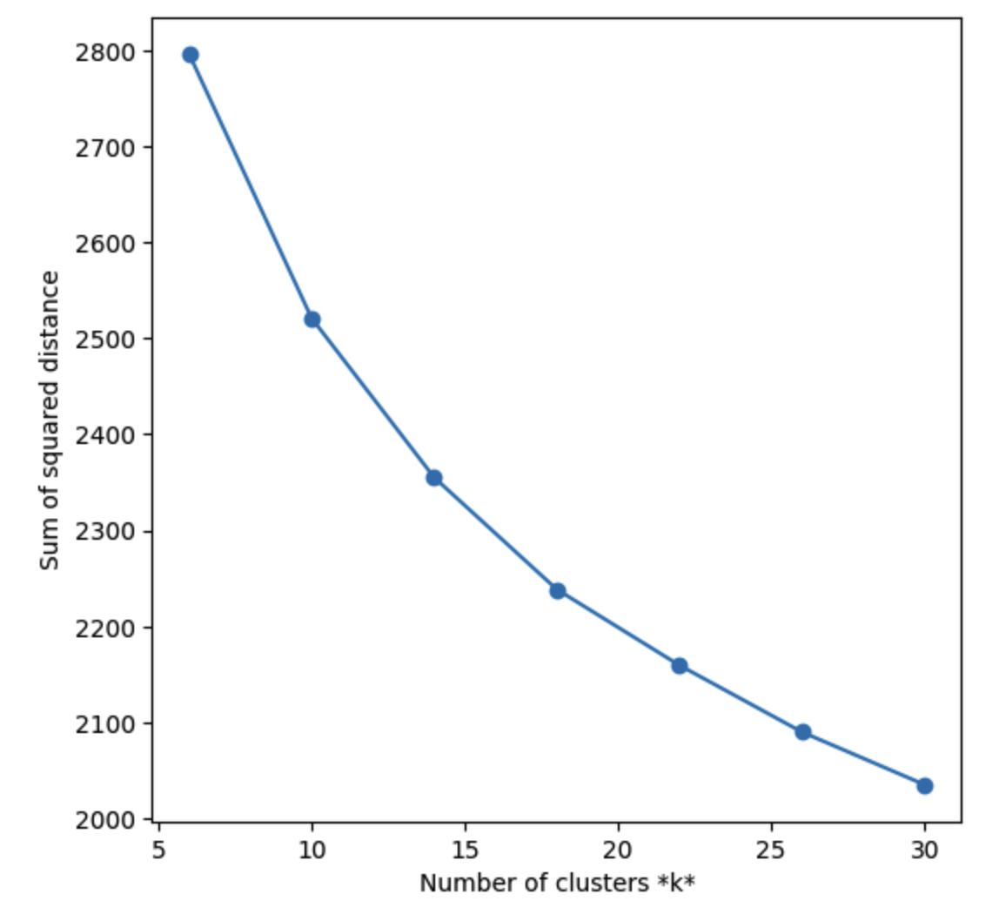

Along with it, we also performed cosine similarity of topics with headlines for which the scatter plot of cluster centers looks like this using t-SNE. 

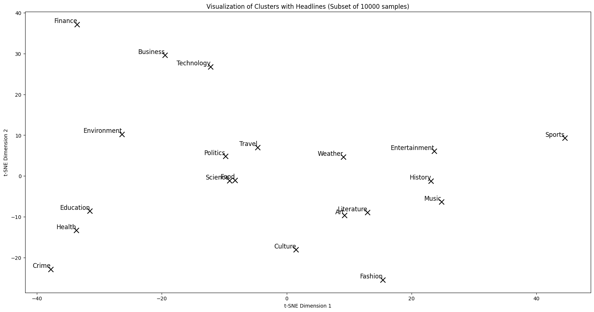

We tried doing cosine similarity predictions with both Word2vec and Glove, and the results using Word2vec embeddings are much better. Here is an example of some news headlines and their topic prediction. 

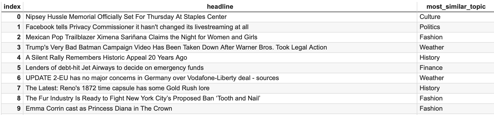

###### Quantitative Metrics 

This k-means clustering gave a sum of squared distances of 2238 with k = 18.

###### Analysis of Model

We chose k-means clustering over other methods like DBScan as we had an idea about the number of clusters. We tried different values of k, and finally landed on k = 18 as the best one. This clustering gave a sum of squared distances of 2238. This score, and the visualizations show that the clusters are not as well-defined as we hoped they would be. One reason for this could be the high dimension of the dataset and adopting a simple average technique for getting the headline word vector.  

##### BERTopic

###### Visualizations and Analysis

**1. BERT with default parameters (DBSCAN)**

Here is the intertopic distance map and the top words for the first eight topics.

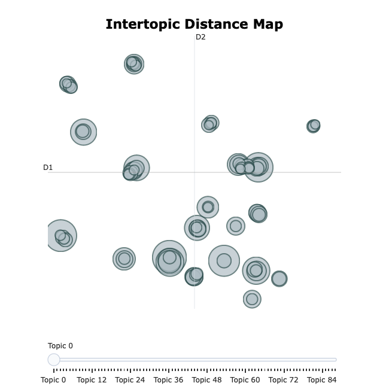

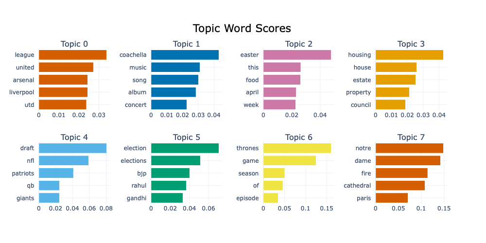

With default parameters, we observed two issues:
a. We are getting 86 clusters with just 20% of data. 
b. Also, lot of topics are going into the –1 cluster(outliers) - around 40% of the points.

**2. BERT with K means (16 clusters)** 

Instead of employing DBSCAN, we opted for K-means with 16 clusters. This strategy is geared towards dividing the data into a predefined number of clusters, providing a clearer and more organized depiction of the topics. This method aids in juxtaposing the outcomes of topic modeling with our initial findings from Word2Vec and GloVe. WCSS of BERT Topic = 1517.

We get the following topics, with each graph depicting importance of words in each cluster. 

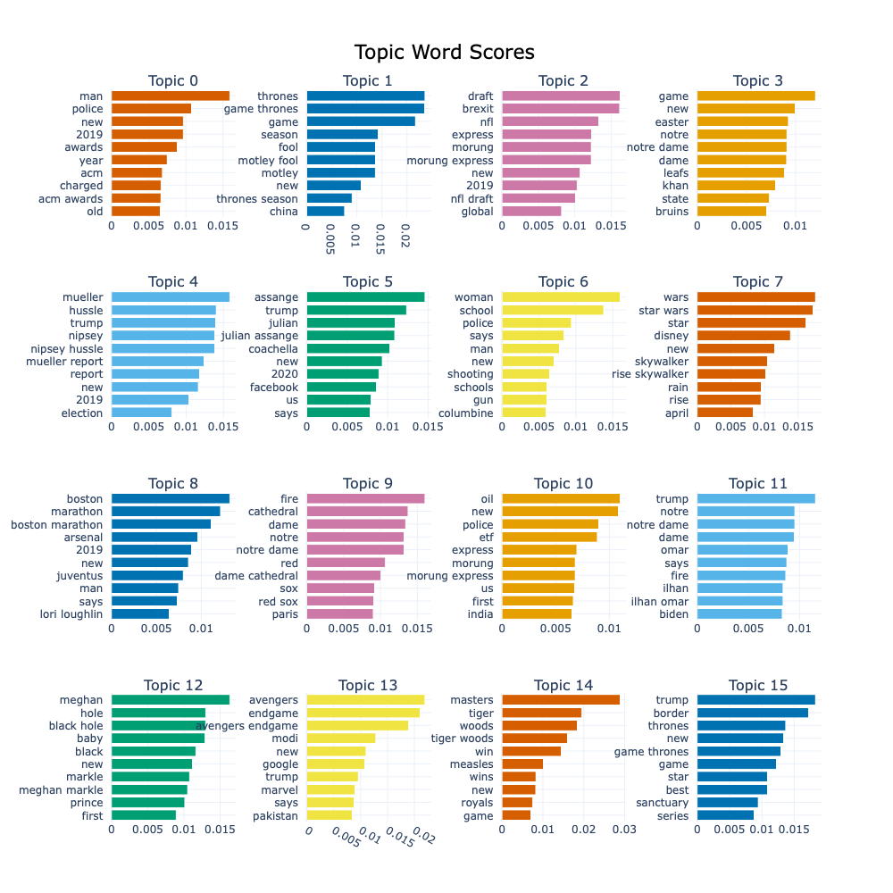

**3. DBSCAN with Parameter Tuning**

Acknowledging the constraints of the default DBSCAN parameters, we conducted experiments to fine-tune these parameters with the objective of decreasing the number of clusters. Furthermore, we introduced an innovative approach of employing hard clustering on outlier clusters. This method entailed the identification of outlier clusters and their reassignment to the nearest cluster, determined by the cosine similarity of the top N words. This adaptive clustering technique is designed to improve the  
coherence and specificity of the topic clusters. 
 
We observed that post assigning the outlier to existing 25 clusters, the results of each headlines were better than default parameters and the results look less fragmented. 

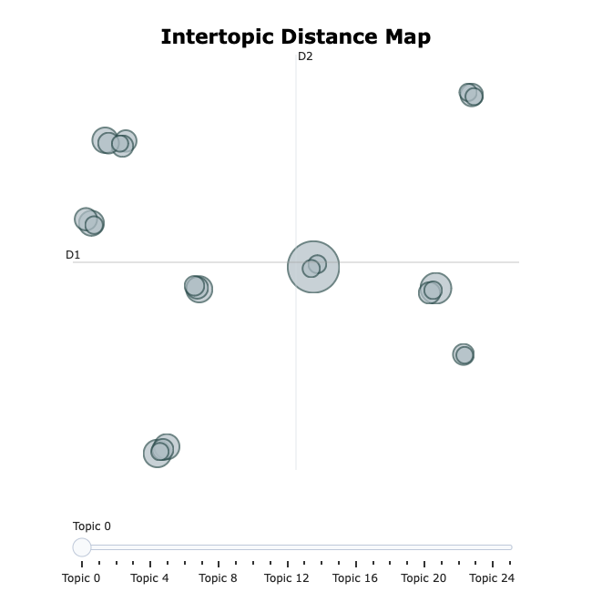

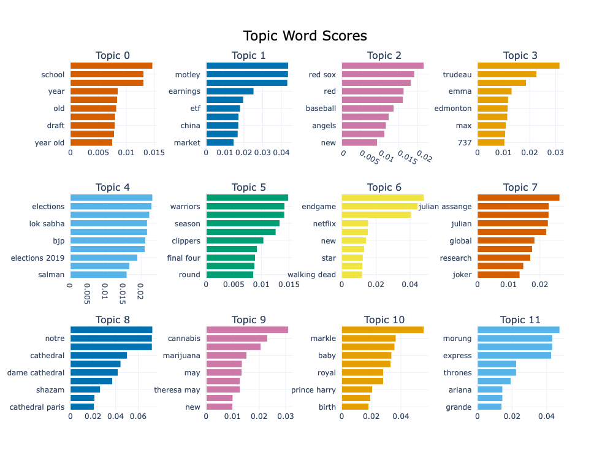

###### Comparison of Clustering

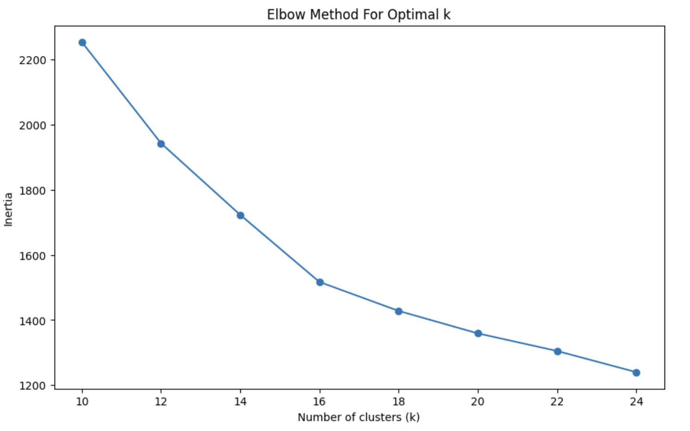

We observe the results with BERT topic are way better than Word2Vec embeddings with clusters. WCSS of BERT Topic is 1517 against WCSS of Word2Vec which was 2238. 

#### Next Steps 

We can expand our analysis by incorporating full news articles instead of just headlines. By doing so, we aim to provide a richer context for our clustering algorithms to work with. We will compare the results obtained from two traditional embeddings methods, Word2Vec and GloVe, with the state-of-the-art BERTopic clustering . Given the increased contextual information available in full news articles, we anticipate that BERTopic clustering will outperform traditional methods. BERT embeddings capture intricate contextual relationships in the text, which can lead to more nuanced and accurate topic representations compared to Word2Vec and GloVe. Further we can extend our analysis, based on human vs fake articles and observe which topics are dominant within fake articles.  

## References
1. Zellers, R., Holtzman, A., Rashkin, H., Bisk, Y., Farhadi, A., Roesner, F., & Choi, Y. (2019). Defending Against Neural Fake News. ArXiv. /abs/1905.12616 
2. Iceland, M. (2023). How Good Are SOTA Fake News Detectors. ArXiv. /abs/2308.02727  
3. Brown, T., Mann, B., Ryder, N., Subbiah, M., Kaplan, J. D., Dhariwal, P., ... & Amodei, D. (2020). Language models are few-shot learners. Advances in neural information processing systems, 33, 1877-1901. 

## Gantt Chart

[Gantt Chart](https://gtvault-my.sharepoint.com/:x:/g/personal/dmishra45_gatech_edu/ETxFnZOXn3JBk6j6xNu7_PwBAAGmj1Igddgi3tMxG-g3pw){:target="blank"}

## Contribution Table

| Name | Contribution |
|----------|----------|
| Vamsi Kalidindi | LLM Fine Tuning | 
| Divij Mishra | Setting up PACE cluster | 
| Karan Nahar | Word embeddings and data preprocessing |
| Parth Athale | Clustering and visualizations |
| Priyanka Singh | LLM Fine Tuning |
